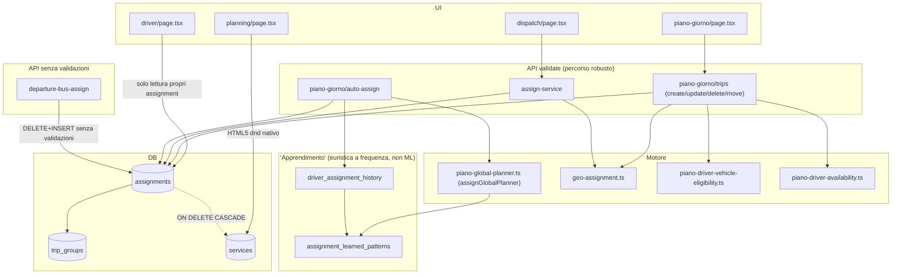

# Audit modulo Assegnazioni — ITS

## 1. Metadati

- **Data audit**: 2026-07-31
- **Branch**: main
- **HEAD al momento dell'audit**: `64bb3eb4c5c6278fde3bc6f8b6bedd34ed600641` (allineato con `origin/main`)
- **Worktree iniziale**: pulito (solo cartella non tracciata `exports/`, preesistente e non correlata al modulo)
- **Modalità**: audit READ-ONLY. Nessun file applicativo modificato, nessun test modificato, nessuna migrazione creata/eseguita, nessun accesso al database di produzione, nessun commit, nessun push.
- **Vincolo rispettato**: WhatsApp (template, webhook Meta, invii) NON è stato toccato né analizzato.
- **Metodologia**: 8 sub-agenti paralleli read-only (Architettura/Mappatura, Database/Integrità, Sicurezza/Tenant Isolation, Concorrenza/Lock, Funzionale/Operativo, UI/UX, Test/Performance/Osservabilità, ML/Automazione), coordinati da un agente principale che ha sintetizzato, deduplicato e classificato i finding in questo documento. Reviewer indipendente in sezione 29.

## 2. Executive summary

Il modulo Assegnazioni ruota attorno al **Piano del Giorno**: i servizi (`services`) vengono raggruppati in **giri** (`trip_groups`) e collegati ad autisti/mezzi tramite la tabella `assignments`. Esistono **due percorsi API paralleli e non equivalenti** per assegnare un servizio (`assign-service` per il flusso Dispatch, `piano-giorno/trips` per il flusso Piano del Giorno) più un terzo percorso, `departure-bus-assign`, usato per i bus di partenza di Rete Ischia, che **non applica nessuna delle validazioni presenti negli altri due**.

I rischi più gravi trovati sono:

1. **IDOR cross-tenant confermato** in `departure-bus-assign` e in `piano-giorno/trips` (`create_trip`/`update_trip`): i `service_id` ricevuti dal client non vengono verificati come appartenenti al tenant dell'operatore prima di scrivere `assignments`, permettendo di collegare un servizio di un altro tenant a un giro del proprio tenant (sezione 10, SEC-01/SEC-02).
2. **Bug di correttezza confermato in `assign-service`**: l'errore dell'`INSERT` su `assignments` non viene controllato. In caso di violazione dell'unique constraint `(service_id, tenant_id)` — scenario reale con due operatori concorrenti sullo stesso servizio — il codice risponde comunque `{ok:true}` mentre nel DB resta un `trip_groups` orfano e l'assegnazione del "perdente" non esiste (sezione 9, CONC-01).
3. **Nessun controllo di sovrapposizione oraria realmente enforced** per lo stesso autista o lo stesso mezzo su due servizi concorrenti: l'unico controllo esistente (`geo-assignment.ts`) è euristico (tempo di trasferimento tra zone), non un vero check di overlap `[start,end)`, ed è per giunta assente del tutto quando l'assegnazione avviene tramite `driver_profile_id` invece di `driver_user_id`. Nessun vincolo DB (`EXCLUDE`) lo previene (sezioni 9, 10).
4. Il presunto "ML" del modulo è, con evidenza tecnica verificata, **un'euristica a pesi hardcoded più un conteggio di frequenza storiche a bucket fissi** — nessun modello addestrato, nessuna libreria ML, nessun training. Buona notizia: i guardrail di sicurezza (vincoli hard prima dello scoring, rispetto del lock manuale, fallback deterministico) sono solidi (sezione 18).
5. Copertura di test quasi assente sulle route più usate: `assign-service` e `departure-bus-assign` hanno **zero test**; i tre endpoint di applicazione controllata (`apply-driver-swap`, `apply-vehicle-binding`, `apply-resolution-suggestion`) hanno test solo sulle funzioni pure, mai sull'handler HTTP reale (sezione 16).

Punti di forza confermati: il flag `locked_by_operator`/`assignment_source` (migrazione `0198`) è rispettato coerentemente da tutti i motori automatici; l'audit trail avanzato (`driver_assignment_history`, `piano_operator_decisions`) è ben progettato dove esiste, ma non copre le route più comuni; la cancellazione di un servizio pulisce correttamente le assegnazioni collegate via `ON DELETE CASCADE`; l'autenticazione centrale (`pricing-auth.ts`) è fail-closed e solida.

## 3. Perimetro

File/aree analizzate (non esaustivo, si veda sezione 4 per la mappa completa):

- `app/(app)/piano-giorno/page.tsx`, `app/(app)/dispatch/page.tsx`, `app/(app)/planning/page.tsx`, `app/(app)/driver/**`
- `app/api/ops/assign-service/route.ts`, `app/api/ops/departure-bus-assign/route.ts`
- `app/api/ops/piano-giorno/**` (route.ts, auto-assign, auto-assign-preview, trips, apply-driver-swap, apply-vehicle-binding, apply-resolution-suggestion, ai-plan, group-diagnostics, unassigned-diagnostics, global-planner-preview, patch-vehicles, driver-sheet, export-excel)
- `app/api/ops/dispatch-data`, `driver-data`, `driver-status`, `driver-kpi`, `driver-assignment-history`, `driver-profiles`, `disponibilita`, `suggestions`
- `lib/piano-global-planner.ts`, `lib/piano-auto-assign-planner.ts`, `lib/dispatch-driver-scoring.ts`, `lib/server/learned-patterns.ts`, `lib/server/assignment-history.ts`, `lib/server/geo-assignment.ts`, `lib/server/piano-driver-swap-preview.ts`, `lib/server/piano-vehicle-binding-preview.ts`, e le altre lib `piano-*` elencate in sezione 4
- `supabase/migrations/*.sql` (226 file, ricerca esaustiva su termini assignment/driver/vehicle/lock/learned/score)
- `tests/unit/piano-*.test.ts`, `tests/integration/auto-assign*.test.ts`, `tests/integration/piano-giorno-trips.test.ts`, `tests/e2e/piano-giorno.spec.ts`

Esplicitamente escluso: WhatsApp, cron di compliance mezzi (`vehicle-expiry-check`, non tocca assignments), moduli bus-network/pickup-runs non direttamente collegati alle assegnazioni driver/vehicle del Piano del Giorno.

## 4. Mappa file

### Pagine UI
| Percorso | Righe | Scopo |
|---|---|---|
| `app/(app)/piano-giorno/page.tsx` | 4622 | Board principale: pool servizi, builder giri, pannello autisti, diagnostica conflitti, auto-assign, AI plan. Monolite client-side, nessuna scomposizione in componenti dedicati. |
| `app/(app)/dispatch/page.tsx` | 455 | Assegnazione rapida singolo servizio→driver/mezzo con suggerimenti di scoring. |
| `app/(app)/planning/page.tsx` | 397 | Board oraria con drag-and-drop HTML5 nativo (no libreria dnd). |
| `app/(app)/driver/page.tsx` + `[serviceId]/page.tsx` | 1525 + 260 | Portale autista: propri assignment, cambio stato, GPS, firma digitale. |
| `app/(app)/fleet-ops/**` | — | Gestione flotta/mezzi/manutenzione/scadenze (fuori perimetro stretto, toccato solo per disponibilità mezzi). |
| `app/(app)/disponibilita/page.tsx` | — | Conferma disponibilità giornaliera — gate obbligatorio per assign-service/auto-assign. |

### Componenti
`components/operations-suggestions.tsx` (suggerimenti sbilanciamento bus/pax), `components/driver/DriverSign.tsx`, `components/driver/PwaInit.tsx`, `components/driver/PasswordGuard.tsx`. Nessun componente dedicato al planner/board principale — logica UI concentrata nelle pagine.

### Route API
| Route | Scopo | Validazioni |
|---|---|---|
| `app/api/ops/assign-service/route.ts` | Assegna/rimuove singolo servizio (flusso Dispatch) | Gate disponibilità, geo-compatibilità (solo se `driver_user_id`), lock manuale |
| `app/api/ops/piano-giorno/trips/route.ts` (1608 righe) | CRUD giri: create/update/delete/move_services, swap_driver, swap_vehicle, delay_vessel | Disponibilità, geo, capacità, overlap mezzo/driver — **percorso più validato** |
| `app/api/ops/departure-bus-assign/route.ts` | Assegna autista/bus per partenze Rete Ischia | **Nessuna validazione** — delete+insert puro |
| `app/api/ops/piano-giorno/auto-assign/route.ts` (1955 righe) | Motore di auto-assegnazione globale | Vincoli hard pre-scoring, rispetta lock manuale |
| `app/api/ops/piano-giorno/apply-driver-swap/route.ts`, `apply-vehicle-binding/route.ts` | Applicazione controllata di proposte specifiche | Optimistic concurrency reale (`updated_at` CAS) |
| `app/api/ops/piano-giorno/apply-resolution-suggestion/route.ts` | Conferma decisione operatore su suggerimento conflitto | Non tocca `assignments` direttamente |
| `app/api/ops/piano-giorno/ai-plan/route.ts` | Chiamata reale a Claude (`claude-haiku-4-5-20251001`) per riepilogo testuale | Sola lettura, non scrive DB |
| `app/api/ops/driver-status/route.ts` | Cambio stato servizio da parte del driver | **Non verifica** che il servizio sia assegnato al driver chiamante |
| `app/api/ops/piano-giorno/patch-vehicles/route.ts` | Riempie `vehicle_label` mancante | Loop N+1 |
| `app/api/ops/tenant-data`, `dispatch-data`, `suggestions` | Dati aggregati per dashboard | Query senza filtro data (storico completo) |

Nessun cron esegue auto-assign; `vercel.json` non contiene voci relative ad assegnazioni (l'unico cron fleet è `vehicle-expiry-check`, compliance documentale, non tocca `assignments`).

### Lib / motore
- **Motore principale**: `lib/piano-global-planner.ts` (`assignGlobalPlanner`), `lib/piano-auto-assign-planner.ts` (preview indipendente)
- **Vincoli hard**: `lib/piano-driver-vehicle-eligibility.ts`, `lib/piano-driver-availability.ts`, `lib/piano-vehicle-timeline.ts`
- **Diagnostica conflitti**: `lib/piano-conflict-classifier.ts`, `lib/piano-conflict-resolution-suggestions.ts`, `lib/piano-conflict-resolution-preview.ts`, `lib/piano-real-giro-diagnostics.ts`
- **"Apprendimento"**: `lib/server/assignment-history.ts`, `lib/server/learned-patterns.ts`
- **Geografia**: `lib/server/geo-assignment.ts`
- **Scoring indipendente (dead code)**: `lib/dispatch-driver-scoring.ts` — mai importato da nessun altro file del repo

### Migrazioni chiave
`0001` (schema iniziale `assignments`), `0135` (`trip_groups`), `0137` (unique `service_id,tenant_id`), `0144` (disponibilità giornaliera), `0182` (fix RLS `trip_groups`), `0198` (`locked_by_operator`/`assignment_source`), `0199` (`piano_operator_decisions`), `0201`/`0202` (audit trail + pattern appresi), `0203` (fix RLS leak cross-tenant sulle tabelle di apprendimento), `0204` (`driver_profile_id`).

### RPC/Trigger
Unica RPC transazionale rilevante: `public.finalize_cancellation_request()` (`0179`, elimina automaticamente `assignments` collegati alla cancellazione di un servizio). Nessun trigger automatico su `assignments`/`trip_groups` per invalidare assegnazioni dopo modifica orario servizio.

### Test
Vedi sezione 16 per l'elenco completo e i gap.

## 5. Architettura

Tre livelli di "intelligenza" coesistono senza integrazione reciproca: l'algoritmo euristico deterministico (`assignGlobalPlanner`), il sistema di conteggio statistico (`learned-patterns`), e una vera chiamata LLM (`ai-plan`, Anthropic Claude) usata solo per generare testo di riepilogo in sola lettura — non collegata al motore di assegnazione.

## 6. Modello dati

### `public.assignments` (evoluzione)
- `0001`: `id, tenant_id, service_id (FK CASCADE), driver_user_id (FK RESTRICT, NOT NULL), vehicle_label (text), created_at`
- `0135`: + `group_id` (FK `trip_groups`, `ON DELETE SET NULL`)
- `0137`: `driver_user_id` reso NULLABLE; **`CREATE UNIQUE INDEX assignments_service_tenant_unique ON assignments (service_id, tenant_id)`** — unico vincolo anti-doppia-assegnazione
- `0198`: + `assignment_source`, `locked_by_operator boolean default false`, `assigned_by`, `assigned_at`, `lock_reason`
- `0204`: + `driver_profile_id` (FK `driver_profiles`, `ON DELETE SET NULL`)

**`vehicle_label` resta sempre testo libero, mai una FK verso `public.vehicles`** — nessuna migrazione introduce `vehicle_id` su `assignments`. Rischio di assegnazioni "orfane" verso un'etichetta che non esiste più in `vehicles` (sezione 24, DB-03).

### Tabelle collegate
- `public.trip_groups` (`0135`): `id, tenant_id (senza FK esplicita verso tenants), date, driver_user_id, vehicle_label, vehicle_capacity, status CHECK IN ('active','cancelled')`. RLS iniziale `using (true)` (bug, sezione 24 DB-06), corretta in `0182`.
- `public.services`: multiple coppie data/ora a seconda del tipo booking (`date/time`, `arrival_date/arrival_time`, `departure_date/departure_time`).
- `public.driver_profiles`, `public.vehicles`: RLS scoped tenant fin dall'introduzione.
- `public.driver_daily_availability`, `vehicle_daily_availability`, `vehicle_time_blocks`, `daily_availability_confirmations` (`0144`): gate di disponibilità giornaliera; `vehicle_time_blocks` ha solo `CHECK(block_to>block_from)`, nessun EXCLUDE anti-overlap.
- `public.driver_assignment_history` (`0201`), `public.assignment_learned_patterns` (`0202`), `public.piano_operator_decisions` (`0199`): audit trail e "apprendimento" — vedi sezioni 18-23.

### Vincoli di integrità verificati
| Vincolo | Presente a DB? | Evidenza |
|---|---|---|
| Un solo assignment per servizio | **Sì** | `assignments_service_tenant_unique` (`0137:8-9`) |
| No overlap orario stesso driver | **No** | ricerca esaustiva `EXCLUDE`/`tstzrange` su 226 migrazioni = 0 risultati |
| No overlap orario stesso mezzo | **No** | idem; `vehicle_label` non è nemmeno una FK |
| Assignment orfano da servizio cancellato | Escluso | `ON DELETE CASCADE` (`0001:65`) |
| Assignment orfano da driver cancellato | Escluso | `ON DELETE RESTRICT`/`SET NULL` (`0001:66`, `0204`) |
| Assignment orfano da mezzo cancellato/rinominato | **Possibile** | nessuna FK `vehicle_id` |
| Consistenza tenant driver/assignment | Solo applicativa (RLS + filtro manuale) | nessun CHECK/trigger incrociato |

## 7. Flusso assegnazione

Due percorsi non equivalenti (vedi sezione 24, FUNC-01):

**A) Dispatch → `assign-service`**: verifica servizio+tenant → verifica `daily_availability_confirmations.confirmed` (409 se assente) → `validateSingleServiceGeography` (solo se `driver_user_id` presente) → crea/aggiorna `trip_groups` + upsert `assignments` → `services.status="assigned"`.

**B) Piano del Giorno → `trips` (`create_trip`)**: verifica disponibilità → `validateTripPayload` (disponibilità driver + conflitti geo/orari) → `resolveVehicleAssignment` (blocchi mezzo) → controllo overbooking (pax vs capacità, bloccante) → `validateDriverVehicleEligibilityPayload` → `validateVehicleTimelinePayload` (overlap mezzo, bloccante) → crea `trip_groups` + `assignments` → push al driver.

**C) `departure-bus-assign` (`assign_driver`)**: `DELETE` + `INSERT` diretto su `assignments`, **nessuna delle validazioni sopra**.

Nessuna delle tre route controlla lo stato del servizio (`completato`/`partito`/`cancelled`) prima di scrivere l'assegnazione (sezione 24, FUNC-02); nessuna verifica server-side che il driver non sia `access_suspended` (sezione 24, FUNC-03).

## 8. Flusso rimozione e riassegnazione

- **Unassign**: `assign-service` (azione `remove`) cancella la riga `assignments`, chiude il gruppo se vuoto, riporta `services.status="new"`. `trips` (`delete_trip`) cancella tutti gli assignment del gruppo e marca il gruppo `cancelled` (non elimina la riga). `departure-bus-assign` (`remove_driver`) fa `DELETE` diretta senza toccare `trip_groups`/`services.status`.
- **Reassign**: **incoerente tra endpoint** — `assign-service` fa update in-place; `trips`/`update_trip` è ibrido (update in-place + delete/insert selettiva per i `service_ids` aggiunti/rimossi); `departure-bus-assign` fa sempre delete completa + insert.
- **Bulk**: `auto-assign` (full-day), `swap_driver`/`swap_vehicle` (riassegnano in blocco tutti i giri attivi di un driver/mezzo per l'intera giornata), `bulk-delete-services`.
- **Drag-and-drop**: assente nel Piano del Giorno (solo select/bottoni); presente solo in `planning/page.tsx` con HTML5 nativo (non touch-compatibile).
- **Undo**: non implementato — nessuna evidenza trovata.

## 9. Concorrenza e lock

Nessun uso di `.rpc(`, transazioni SQL reali, `pg_advisory_lock`, `SELECT...FOR UPDATE` o `EXCLUDE` in tutto il modulo. Tutte le scritture multi-tabella sono sequenze di chiamate REST separate (al più raggruppate con `Promise.all`, che non garantisce atomicità).

| Scenario | Verdetto | Evidenza |
|---|---|---|
| Due operatori assegnano lo stesso servizio | **VULNERABILE** | `assign-service/route.ts` righe 172-180: errore insert non controllato → falso `{ok:true}` + `trip_groups` orfano. Caso "già assegnato": update incondizionato, last-write-wins silenzioso |
| Stesso driver, servizi sovrapposti | **VULNERABILE** | Solo euristica geografica (tempo di trasferimento), non un vero check overlap `[start,end)`; TOCTOU (check-poi-scrivi); assente del tutto se si usa `driver_profile_id` |
| Stesso mezzo, servizi sovrapposti | **VULNERABILE** | Nessun controllo in `assign-service`/`departure-bus-assign`; `vehicleIntervalsOverlap` esiste ma è usato solo dentro il planner automatico, non come guardia generale |
| Lock esplicito / TTL / lock abbandonato | **DA VERIFICARE (non è quello che sembra)** | `locked_by_operator` è un flag permanente "assegnato manualmente", non un lock di sessione con TTL — non esiste alcun meccanismo "in modifica da altro operatore" |
| Doppio invio (refresh/rete lenta) | **PARZIALE** | Disabled-on-click diffuso lato client; nessuna idempotency key server-side generale |
| Bulk assign vs modifica singola concorrente | **VULNERABILE** | Snapshot di `locked_by_operator` letto a inizio richiesta `auto-assign`, non rivalidato al momento dell'upsert finale (finestra TOCTOU) |
| Auto-assign sovrascrive manuale | **SICURO by design** | `locked_by_operator` escluso esplicitamente da candidati e da `regenerate_all` DELETE; finestra di race residua come sopra |
| Override manuale tracciato | **PARZIALE** | Tracciato per `apply-driver-swap`/`apply-vehicle-binding`/`auto-assign` (`logAssignmentChange`); **`assign-service`, il percorso più comune, non chiama mai `logAssignmentChange`** |
| Transazioni DB reali | **VULNERABILE** | Solo `Promise.all` (non atomico); uniche eccezioni: `apply-driver-swap`/`apply-vehicle-binding` con CAS su `updated_at` (409 "stale"), e la RPC `finalize_cancellation_request` |
| Unique/EXCLUDE anti-race | **MINIMA** | Solo `assignments_service_tenant_unique (service_id, tenant_id)`; nessun EXCLUDE per overlap driver/mezzo |

## 10. Sicurezza e tenant isolation

Route esaminate: `assign-service`, `departure-bus-assign`, `piano-giorno/{auto-assign, apply-driver-swap, apply-vehicle-binding, apply-resolution-suggestion, patch-vehicles, trips}`, `dispatch-data`, `driver-assignment-history`, `driver-status`, `driver-profiles`, `driver-data`, `driver-kpi`.

Finding principali (dettaglio in sezione 24):
- **SEC-01/SEC-02 (CRITICAL)**: IDOR cross-tenant confermato in `departure-bus-assign` e `piano-giorno/trips` (`create_trip`/`update_trip`) — i `service_id` ricevuti non vengono verificati come appartenenti al tenant prima della scrittura.
- **SEC-03 (HIGH)**: join `services!inner(...)` senza filtro tenant esplicito sul lato joinato — sfruttabile solo come conseguenza di SEC-01/02, ma il difetto di query è oggettivo.
- **SEC-04 (HIGH)**: `driver-status` (ruolo `driver` incluso) non verifica che il servizio sia effettivamente assegnato al driver chiamante — un autista può alterare lo stato del servizio di un collega.
- **SEC-05 (MEDIUM)**: `driver_user_id`/`driver_profile_id` non sempre verificati come appartenenti al tenant prima della scrittura.
- **SEC-06 (MEDIUM)**: error leak sistemico — messaggi Postgres/PostgREST raw restituiti al client (information disclosure sullo schema, non leak dati cross-tenant).
- **SEC-07 (LOW/INFO)**: password iniziale prevedibile (numero di telefono) per account autista, mitigata da `force_password_change` — da verificare se l'enforcement è bloccante.

Buone pratiche confermate: pattern "controlled apply" (`apply-driver-swap`/`apply-vehicle-binding`/`apply-resolution-suggestion` — il client invia solo un riferimento hash, mai ID sensibili diretti); `assign-service` valida correttamente il singolo `service_id`; autenticazione centrale (`pricing-auth.ts`) fail-closed, nessun bypass tenant tramite header; nessun mass assignment rilevato.

## 11. Ruoli e permessi

Ruoli ammessi sulle route di assegnazione: `admin`, `operator`, `supervisor` (via `authorizePricingRequest`); `driver-status` ammette anche `driver` (privilegio minimo) ma senza verificare la titolarità del servizio (SEC-04). `membership.suspended` è controllato fail-closed in `pricing-auth.ts` per tutte le route esaminate (nessuna passa `allowSuspended: true`). `access_suspended` sui `driver_profiles` (concetto diverso da `membership.suspended`, riguarda l'autista come risorsa assegnabile) è filtrato solo in UI e negli algoritmi automatici, non negli endpoint di scrittura manuale (`assign-service`, `trips`) — gap descritto in FUNC-03.

## 12. Stato servizi e vincoli operativi

Enum stato servizio: `needs_review, new, assigned, partito, arrivato, completato, problema, cancelled` (nessuno stato `no_show`). **Nessun controllo server-side blocca l'assegnazione a un servizio già `completato`/`partito`/`cancelled`** in `assign-service` o `trips` — l'unico filtro esiste lato UI Dispatch (cosmetic, bypassabile chiamando l'API direttamente). Controlli invece ben implementati e bloccanti: capacità mezzo vs pax (`trips/route.ts`, overbooking → 409), disponibilità/blocco mezzo (`vehicle_commitments`, `vehicle-availability.ts`), overlap orario mezzo/driver **solo dentro `trips`** (assente in `assign-service`/`departure-bus-assign`).

## 13. UI e workflow operatore

Layout: Dispatch (lista righe select+bottone), Planning (board oraria con dnd HTML5 nativo, non touch), Piano del Giorno (3 colonne fisse, desktop-only, nessun breakpoint mobile). Nessun optimistic update — tutte le mutazioni sono "pessimistic" con stato di loading esplicito (niente rollback visivo da gestire, ma nessun feedback immediato). Conferme distruttive **incoerenti**: eliminazione giro chiede `window.confirm()`, rimozione/spostamento di un singolo servizio no. Nessun banner/lock "in modifica da altro operatore" nonostante Supabase Realtime attivo. Distinzione manuale/automatico ben curata nella sezione diagnostica conflitti (badge severità, confidenza, spiegazione testuale, stato conferma operatore). Rischio di mis-click concreto: bottoni "Sposta"/"Rimuovi" piccoli e ravvicinati nel dettaglio giro, "Rimuovi" senza conferma. Difetti minori di accessibilità: select senza label associata, nesting HTML non valido (`role="button"` dentro `<button>`).

## 14. Driver view

Il driver vede solo i propri `assignments`/`services` filtrati per `driver_user_id = utente corrente` (pattern corretto, verificato in `driver-data/route.ts`). Cambio stato con conferma esplicita per "completato", cattura GPS ad ogni cambio stato, push notification su nuova assegnazione/riassegnazione/ritardo. **Eccezione**: `driver-status/route.ts` (POST, cambio stato) non replica il filtro per titolarità presente in `driver-data` (GET) — vedi SEC-04.

## 15. Audit e osservabilità

Due sistemi di audit paralleli e non equivalenti:
- **`ops_audit_events`**: usato da 18 route del progetto (incluso lo shuttle module), ma **mai chiamato da nessuna route del modulo assegnazioni** per eventi di business — solo per eventi di autenticazione/autorizzazione negata (via `pricing-auth.ts`).
- **`driver_assignment_history` + `piano_operator_decisions`**: audit trail reale per-servizio (before/after, hash anti-duplicazione), ma scritto solo da `apply-driver-swap`, `apply-vehicle-binding`, `apply-resolution-suggestion`, `auto-assign`. **`assign-service`, `departure-bus-assign`, `patch-vehicles`, `suggestions/executeMovePax` — cioè le route di scrittura più frequenti — non scrivono in nessuno dei due audit trail.**

## 16. Test

| Categoria | Copertura |
|---|---|
| Route API con test HTTP-level reali | `piano-giorno/auto-assign`, `piano-giorno/trips` (integration test) |
| Route API **senza alcun test** | `assign-service`, `departure-bus-assign`, `patch-vehicles`, `dispatch-data`, `tenant-data`, `suggestions` |
| Handler mai invocati (solo funzioni pure testate) | `apply-driver-swap`, `apply-vehicle-binding`, `apply-resolution-suggestion` |
| Tenant isolation | Suite dedicate esistono per shuttle-schedules/pickup-runs/escursioni; **nessuna equivalente per le route di assegnazione** |
| Overlap driver/vehicle | Logica pura ben testata (`geo-assignment.test.ts`, `piano-conflict-classifier.test.ts`), ma non a livello di route manuale (`assign-service`) |
| "Apprendimento"/ML | **Zero test** su `lib/server/learned-patterns.ts` e `lib/server/assignment-history.ts` |
| Lock/concorrenza | Nessun test simula un update concorrente per verificare la risposta 409 "stale" di `apply-driver-swap`/`apply-vehicle-binding` |
| E2E | `tests/e2e/piano-giorno.spec.ts`, gated da `E2E_REAL_APP=true`, skip di default |

## 17. Performance

- **Query senza filtro data**: `tenant-data`, `dispatch-data`, `suggestions` caricano lo storico completo `assignments`/`status_events`/`services` del tenant senza limite temporale (confronto positivo: `driver-kpi/route.ts` applica correttamente `gte("date", fromDate)` — il pattern corretto è noto ma non applicato ovunque).
- **N+1**: `patch-vehicles/route.ts` esegue un loop sequenziale di 2 query per ogni giro senza mezzo, invece di un batch update.
- **`select("*")` diffuso** dove basterebbero poche colonne (`tenant-data`, `dispatch-data`, `suggestions`, `driver-data`, `vehicles`).
- **Aggregazioni in memoria JS**: `driver-assignment-history/route.ts` carica fino a 5000 righe `assignment_learned_patterns` e aggrega in JS invece di SQL; `learned-patterns.ts` ricalcola da zero l'intero storico del tenant dopo ogni singola azione operatore (non incrementale).
- **Realtime + polling di fallback**: `useTenantOperationalData` ha debounce 400ms + polling 20s di fallback; `dispatch/page.tsx` non ha debounce sugli eventi realtime — ogni evento richiama endpoint che caricano lo storico completo, amplificando i problemi sopra.
- Indici adeguati sulle tabelle nuove (`0199`/`0201`/`0202`); `assignments` storica ha solo PK + unique `(service_id, tenant_id)`, nessun indice composito su `(tenant_id, driver_user_id)`/`(tenant_id, group_id)`.

## 18. Verità sul presunto ML

**Classificazione: EURISTICA** (con componenti di SISTEMA A REGOLE per i vincoli hard). **Non presente machine learning reale.**

Evidenza:
- Zero librerie ML in `package.json`, zero import di framework ML (`tensorflow`, `scikit-learn`, `onnxruntime`, ecc.) in tutto il repo.
- Il motore reale (`lib/piano-global-planner.ts:166-190`, `lib/piano-auto-assign-planner.ts:155-256`) è una somma pesata di costanti scritte a mano (`-100`, `-80`, `+70`, `+110`, ecc.), con vincoli hard (disponibilità, capacità, eleggibilità) valutati **prima e indipendentemente** da qualunque punteggio.
- La componente "appresa" (`assignment_learned_patterns`) è un **conteggio di frequenze** (accettazioni vs correzioni operatore) mappato a un aggiustamento a **quattro bucket hardcoded** (soglie 0.8/0.6/0.4 → adjustment ±50/±25), non una stima statistica di parametri.
- Un modulo di scoring alternativo (`lib/dispatch-driver-scoring.ts`) esiste ma è **codice morto**, mai importato da nessun altro file.
- Una vera chiamata LLM esiste (`app/api/ops/piano-giorno/ai-plan/route.ts`, Claude Haiku) ma produce solo testo di riepilogo in sola lettura, **non integrata nel motore di assegnazione**.

## 19. Pipeline dati ML

**Input**: giorno settimana, macro-categoria (arrivo/partenza/navetta), zona/hotel, fascia oraria, compagnia traghetto, pax, disponibilità dichiarata, carico giornaliero, conteggi storici accettazioni/correzioni. Nessun dato personale libero (note, telefono, messaggi) entra nello scoring.

**Output**: assegnazione diretta scritta su `assignments`/`trip_groups`, più `score`/`confidence`/`explanation[]`/`warnings[]` per gruppo proposto (bucket di confidenza discreti: 39/69/88/100, non probabilità calibrate).

**"Training"**: nessuno in senso ML. `updateLearnedPatterns()` ricalcola da zero (non incrementale) i conteggi aggregati per tenant, fire-and-forget dopo ogni azione operatore (`.catch(() => undefined)`, mai bloccante). Cold start esplicito: `MIN_OBSERVATIONS_PER_PATTERN=5`, `MIN_TOTAL_TENANT_OBSERVATIONS=20` (`lib/server/learned-patterns.ts:10-11`).

## 20. Decisioni automatiche e override

`locked_by_operator=true` esclude esplicitamente un'assegnazione sia dai candidati sia dalla DELETE di `regenerate_all` — verificato coerente in tutto `auto-assign/route.ts`. Un operatore può sempre sovrascrivere manualmente un'assegnazione automatica (nessuna distinzione di permesso), tracciato in `driver_assignment_history` **solo** per i percorsi `apply-driver-swap`/`apply-vehicle-binding`/`auto-assign` — **non** per `assign-service`, il percorso di override manuale più comune (stesso gap della sezione 15).

## 21. Metriche e qualità ML

Nessuna metrica di accuracy/precision/recall/drift/A-B test. Esiste un proxy operativo grezzo: `correction_rate` (correzioni/totale) esposto in `driver-assignment-history/route.ts` e mostrato in UI — utile ma non una metrica di validazione formale. Nessun confronto con baseline, nessuno shadow mode.

## 22. Privacy e governance ML

Nessun dato personale libero (note, telefono, messaggi WhatsApp) entra nelle feature di scoring/apprendimento — solo categorie derivate deterministicamente (zona, fascia oraria, tipo servizio). **Precedente storico rilevante**: la migrazione `0203_fix_rls_learning_tables.sql` documenta esplicitamente un leak cross-tenant preesistente sulle tabelle `driver_assignment_history`/`assignment_learned_patterns` ("le policy precedenti consentivano accesso tenant troppo ampio... qualsiasi utente autenticato di leggere/scrivere dati di qualsiasi tenant"), già corretto. Nessuna policy di retention/anonimizzazione esplicita trovata per `driver_assignment_history`.

## 23. Failure modes ML

`loadLearnedPatterns` ritorna `[]` silenziosamente su errore o dati insufficienti (fail-closed verso "nessun aggiustamento", mai un crash). L'intero blocco planner con pattern appresi è in try/catch con fallback a un algoritmo greedy deterministico più semplice (`plannerUsed: "greedy_fallback"`). Nessun feature flag/kill-switch esplicito trovato per disattivare il planner o i pattern appresi indipendentemente — l'unica "disattivazione" possibile è non invocare mai l'azione (nessun cron la esegue automaticamente).

## 24. Finding

Legenda severità: CRITICAL, HIGH, MEDIUM, LOW, INFO. Stato: CONFERMATO, PROBABILE, DA VERIFICARE, GIÀ RISOLTO.

### CRITICAL

**SEC-01 — IDOR cross-tenant in `departure-bus-assign`**
- Stato: CONFERMATO
- File: `app/api/ops/departure-bus-assign/route.ts`, azioni `assign_driver` (righe 144-185), `remove_driver` (righe 188-201)
- Descrizione: nessuna query verifica che i `service_id` ricevuti nel body appartengano al tenant dell'operatore autenticato prima di `DELETE`+`INSERT` su `assignments`.
- Impatto: un operatore del tenant A può collegare un servizio del tenant B a un proprio `assignment` (tenant_id=A), causando incoerenza dati e potenziale leak di dettagli del servizio B (vedi SEC-03).
- Scenario concreto: `POST /api/ops/departure-bus-assign {action:"assign_driver", service_ids:["<uuid-tenant-B>"], driver_user_id:"<driver-A>"}`.
- Soluzione minima: prima dell'insert, `SELECT id FROM services WHERE id IN (service_ids) AND tenant_id = tenantId` e verificare `length === service_ids.length`, altrimenti 400/404.
- Soluzione strutturale: estrarre una funzione condivisa `assertServiceIdsBelongToTenant()` riusata da tutte le route di assegnazione (incluso SEC-02).
- Test: aggiungere test di tenant isolation per `assign_driver`/`remove_driver` con `service_id` di un tenant diverso.
- Rollback: nessuno (solo aggiunta di un controllo, non rimuove funzionalità).
- Dipendenze: nessuna.
- Fatto vs ipotesi: fatto, verificato leggendo il codice.

**SEC-02 — IDOR cross-tenant in `piano-giorno/trips` (`create_trip`, `update_trip`)**
- Stato: CONFERMATO
- File: `app/api/ops/piano-giorno/trips/route.ts`, `validateTripPayload` (righe 1296-1406, in particolare 1312-1322), `create_trip` (righe 82-187), `update_trip` (righe 305-330), `_assignServicesToGroup` (righe 796-824)
- Descrizione: `validateTripPayload` filtra i `services` per tenant ma non verifica che `serviceRows.length === params.serviceIds.length`; l'array **originale** (non filtrato) viene comunque passato a `_assignServicesToGroup`, che scrive un `assignments` per ogni id fornito, incluso quello non appartenente al tenant.
- Impatto: stesso di SEC-01, ma sul percorso più usato del Piano del Giorno.
- Scenario concreto: `create_trip {service_ids:["<id-valido-A>", "<id-tenant-B>"], driver_user_id:"<driver-A>"}` → la validazione passa (l'id estraneo è solo ignorato nei calcoli pax/conflitti), ma l'assignment viene comunque scritto.
- Soluzione minima: dopo il fetch in `validateTripPayload`, se `serviceRows.length !== params.serviceIds.length` ritornare errore bloccante 400/404 prima di proseguire.
- Soluzione strutturale: come SEC-01.
- Test: test di tenant isolation su `create_trip`/`update_trip` con un `service_id` misto tenant.
- Rollback: nessuno.
- Dipendenze: condivide la soluzione strutturale con SEC-01.
- Fatto vs ipotesi: fatto, verificato riga per riga.

**CONC-01 — Errore insert non controllato in `assign-service` → falso successo + `trip_groups` orfano**
- Stato: CONFERMATO
- File: `app/api/ops/assign-service/route.ts`, righe 172-183
- Descrizione: l'insert su `assignments` non controlla `.error`; in caso di violazione dell'unique index `(service_id, tenant_id)` (due operatori concorrenti sullo stesso servizio, o un doppio-click che sfugge al `disabled`), il codice prosegue comunque aggiornando `services.status="assigned"` e rispondendo `{ok:true}`.
- Impatto: l'operatore "perdente" vede un salvataggio riuscito in UI, ma nel DB l'assegnazione non esiste (resta solo quella del primo) e resta un `trip_groups` orfano.
- Scenario concreto: due operatori assegnano contemporaneamente lo stesso servizio non ancora assegnato a driver diversi.
- Soluzione minima: controllare `insertError` e rispondere 409 con messaggio "assegnazione già effettuata da un altro operatore, ricarica la pagina".
- Soluzione strutturale: introdurre un pattern CAS (compare-and-swap) uniforme, come già fatto in `apply-driver-swap`/`apply-vehicle-binding`.
- Test: simulare race condition (due insert concorrenti sullo stesso `service_id`) e verificare risposta 409 controllata, nessun `trip_groups` orfano.
- Rollback: nessuno.
- Dipendenze: nessuna.
- Fatto vs ipotesi: fatto, verificato leggendo il codice.

**FUNC-01 — `departure-bus-assign` privo di qualunque validazione operativa**
- Stato: CONFERMATO
- File: `app/api/ops/departure-bus-assign/route.ts`, righe 144-185
- Descrizione: a differenza di `assign-service`/`trips`, questa route non verifica disponibilità driver, geo-compatibilità, overlap orario, capacità mezzo, stato del servizio, o sospensione dell'autista.
- Impatto: possibile assegnazione di un autista non disponibile/sospeso, o con servizi sovrapposti, senza alcun blocco.
- Scenario concreto: assegnazione di un autista già impegnato altrove nello stesso slot tramite bus di partenza.
- Soluzione minima: riusare `validateSingleServiceGeography`/i controlli di disponibilità già esistenti in `assign-service` prima dello scrivere.
- Soluzione strutturale: unificare i tre percorsi di scrittura (`assign-service`, `trips`, `departure-bus-assign`) dietro una funzione di validazione condivisa.
- Test: test che verifichi il blocco su driver non disponibile/sospeso per questa route.
- Rollback: nessuno.
- Dipendenze: SEC-01 (stessa route).
- Fatto vs ipotesi: fatto.

### HIGH

**SEC-03 — Join `services!inner(...)` senza filtro tenant esplicito sul lato joinato**
- Stato: CONFERMATO (sfruttabile come conseguenza di SEC-01/02)
- File: `app/api/ops/assign-service/route.ts:242`, `app/api/ops/piano-giorno/trips/route.ts:35,1345-1350,1465-1469`
- Descrizione: filtro `tenant_id` applicato solo su `assignments`, non sulla tabella `services` joinata; se esiste un record incoerente (da SEC-01/02), i campi del servizio "estraneo" (orario, hotel, meeting point) possono comparire in messaggi d'errore.
- Soluzione minima: aggiungere `tenant_id` alla select del join e verificare/filtrare esplicitamente lato query.
- Test: verificare che un messaggio d'errore non contenga mai dati di un servizio di altro tenant.
- Fatto vs ipotesi: fatto.

**SEC-04 — Broken access control orizzontale in `driver-status`**
- Stato: CONFERMATO
- File: `app/api/ops/driver-status/route.ts`, righe 22-63, 106-115
- Descrizione: il ruolo `driver` è ammesso ma l'unico controllo di titolarità è `services.tenant_id = tenantId`, senza verificare `assignments.driver_user_id = utente_corrente`. L'endpoint GET analogo (`driver-data`) applica correttamente questo filtro — il pattern corretto esiste nel codebase ma non è replicato qui.
- Impatto: un autista può alterare lo stato di un servizio non suo (es. marcarlo "completato"/"cancelled"/"problema").
- Soluzione minima: aggiungere verifica `assignments.driver_user_id = user.id` (o `driver_profile_id` collegato) quando `membership.role === "driver"`.
- Test: test che un driver non possa modificare lo stato di un servizio assegnato a un collega.
- Fatto vs ipotesi: fatto.

**CONC-02 — Nessun vero controllo overlap orario stesso driver**
- Stato: CONFERMATO
- File: `lib/server/geo-assignment.ts:113-186`, `app/api/ops/assign-service/route.ts:113-125,234-287`
- Descrizione: il controllo esistente valuta solo il tempo di trasferimento tra zone, non un overlap `[start,end)` esplicito; è inoltre assente del tutto quando l'assegnazione avviene tramite `driver_profile_id` (solo `if (body.driver_user_id)` attiva il controllo).
- Soluzione minima: aggiungere un controllo esplicito di overlap temporale (analogo a `vehicleIntervalsOverlap` già esistente per i mezzi) applicato sempre, indipendentemente dal tipo di identificatore driver.
- Test: due assegnazioni sovrapposte allo stesso driver devono essere bloccate o generare warning esplicito.
- Fatto vs ipotesi: fatto.

**CONC-03 — Nessun controllo overlap mezzo in `assign-service`/`departure-bus-assign`**
- Stato: CONFERMATO
- File: `app/api/ops/assign-service/route.ts` (nessuna chiamata a `vehicleIntervalsOverlap`), `lib/piano-vehicle-timeline.ts:43-49`
- Descrizione: la funzione di overlap mezzo esiste ed è usata solo dentro `auto-assign`/preview, non come guardia generale sulle scritture manuali.
- Soluzione minima: invocare `vehicleIntervalsOverlap`/`findVehicleTimelineConflict` anche in `assign-service` prima di scrivere.
- Fatto vs ipotesi: fatto.

**CONC-06 — Bulk `auto-assign` con snapshot non rivalidato al commit**
- Stato: CONFERMATO
- File: `app/api/ops/piano-giorno/auto-assign/route.ts`, righe 951-991 (snapshot), 1875 (upsert finale con `ignoreDuplicates:false`)
- Descrizione: lo snapshot di `locked_by_operator` è letto a inizio richiesta; se un operatore blocca manualmente un'assegnazione dopo lo snapshot ma prima dell'upsert finale, viene sovrascritta senza controllo.
- Soluzione minima: rileggere lo stato `locked_by_operator` immediatamente prima dell'upsert finale ed escludere le righe cambiate nel frattempo.
- Fatto vs ipotesi: fatto.

**DB-01/DB-02 — Nessun vincolo DB (EXCLUDE) anti-overlap driver/mezzo**
- Stato: CONFERMATO
- File: ricerca esaustiva su 226 migrazioni, 0 risultati per `EXCLUDE`/`tstzrange`/`gist`
- Descrizione: l'unica barriera anti-race è applicativa (e parziale, vedi CONC-02/03); un vincolo `EXCLUDE USING gist` con `btree_gist` fornirebbe una garanzia indipendente dal codice applicativo.
- Soluzione strutturale: valutare l'introduzione di un range temporale esplicito su `assignments` (richiede `linked service.date/time`, non banale con lo schema attuale a più coppie data/ora) + estensione `btree_gist` + `EXCLUDE`.
- Fatto vs ipotesi: fatto (assenza confermata), ma la soluzione strutturale richiede design (M2).

**DB-07 — Nessuna transazione DB reale per le scritture multi-tabella**
- Stato: CONFERMATO
- File: `assign-service/route.ts:131-144`, `auto-assign/route.ts:1874-1878`, `patch-vehicles/route.ts:111-122` (tutti `Promise.all` non atomici)
- Descrizione: un fallimento parziale lascia stato incoerente tra `trip_groups`, `assignments`, `services.status`.
- Soluzione strutturale: introdurre una RPC Postgres transazionale per le operazioni multi-tabella più critiche (analoga a `finalize_cancellation_request`).
- Fatto vs ipotesi: fatto.

**TEST-01 — `assign-service` e `departure-bus-assign` senza alcun test**
- Stato: CONFERMATO
- Descrizione: le due route di scrittura più usate/più a rischio (SEC-01, CONC-01, FUNC-01) non hanno nessun test unit/integration/e2e.
- Soluzione minima: aggiungere test di integrazione HTTP-level per entrambe (happy path, tenant isolation, race condition, driver sospeso).
- Fatto vs ipotesi: fatto.

**TEST-03 — Nessuna suite di tenant isolation per le route di assegnazione**
- Stato: CONFERMATO
- Descrizione: esistono suite dedicate per shuttle-schedules/pickup-runs/escursioni ma non per `assign-service`/`departure-bus-assign`/`apply-*`/`patch-vehicles`/`dispatch-data`/`tenant-data`/`suggestions`.
- Fatto vs ipotesi: fatto.

### MEDIUM

**SEC-05 — `driver_user_id`/`driver_profile_id` non sempre verificati contro il tenant**
- Stato: CONFERMATO — `assign-service/route.ts:113-125,234-249`, `departure-bus-assign/route.ts:144-185`, `trips/route.ts:1244-1294` (controllo scatta solo se è presente un veicolo)
- Impatto attenuato da filtro tenant su `push_subscriptions` nelle notifiche; rischio principale è integrità dati (riferimenti "orfani" cross-tenant), non leak diretto.
- Soluzione minima: validare sempre `driver_user_id`/`driver_profile_id` contro `memberships`/`driver_profiles` filtrati per tenant, indipendentemente dalla presenza di un veicolo.

**SEC-06 — Error leak sistemico (messaggi Supabase raw)**
- Stato: CONFERMATO — `dispatch-data/route.ts:36`, `driver-assignment-history/route.ts:118,136-137`, `trips/route.ts` (vari), `patch-vehicles/route.ts:34,48,68`
- Soluzione minima: messaggi generici lato client, dettaglio loggato solo server-side.

**CONC-04 — `locked_by_operator` non è un lock collaborativo con TTL**
- Stato: CONFERMATO (non è un bug, ma un gap concettuale rispetto all'atteso)
- Descrizione: è un flag permanente anti-auto-assign, non un lock di sessione; due operatori umani possono modificare la stessa riga senza alcun avviso.
- Soluzione minima: aggiungere un banner realtime "in modifica da altro operatore" basato su presence Supabase Realtime (già usato altrove nel progotto per il tracking driver).
- Soluzione strutturale: vero lock di editing con TTL e rilascio automatico.

**CONC-07 — `assign-service` non scrive l'audit trail business-level**
- Stato: CONFERMATO
- File: `assign-service/route.ts` (nessuna chiamata a `logAssignmentChange`)
- Soluzione minima: aggiungere la chiamata, come già fatto in `apply-driver-swap`/`apply-vehicle-binding`/`auto-assign`.

**FUNC-02 — Nessun controllo server-side sullo stato del servizio prima dell'assegnazione**
- Stato: CONFERMATO
- File: `assign-service/route.ts`, `trips/route.ts` (create/update/move) — nessuno legge/usa `services.status` come guardia
- Soluzione minima: bloccare (o richiedere conferma esplicita) l'assegnazione se `services.status IN ('completato','partito','cancelled')`.

**FUNC-03 — `access_suspended` (autista sospeso) non enforced server-side nelle scritture manuali**
- Stato: CONFERMATO
- File: rispettato solo in UI dropdown (`piano-giorno/page.tsx:2357`) e negli algoritmi automatici (`auto-assign`), non in `assign-service`/`trips` create/update/move/swap
- Soluzione minima: aggiungere il filtro anche nelle route di scrittura manuale.

**UI-01 — Nessun lock/banner collaborativo visibile**
- Stato: CONFERMATO — vedi CONC-04, stessa causa architetturale.

**UI-02 — Conferme distruttive incoerenti**
- Stato: CONFERMATO — `piano-giorno/page.tsx:1229` (delete trip con `confirm()`) vs `:2254-2280,4523-4529` (remove/move service senza conferma).
- Soluzione minima: uniformare con conferma esplicita per tutte le azioni che rimuovono/spostano un servizio da un giro.

**UI-05 — Tabelle dense con rischio di mis-click**
- Stato: CONFERMATO — bottoni "Sposta"/"Rimuovi" piccoli e ravvicinati (`piano-giorno/page.tsx:4394-4529`), "Rimuovi" senza conferma (vedi UI-02).

**TEST-02 — Handler `apply-*` mai invocati nei test**
- Stato: CONFERMATO — solo funzioni pure testate per `apply-driver-swap`, `apply-vehicle-binding`, `apply-resolution-suggestion`.

**TEST-04 — Nessun test per il sistema di "apprendimento"**
- Stato: CONFERMATO — `lib/server/learned-patterns.ts`, `lib/server/assignment-history.ts` senza copertura.

**TEST-05 — Problemi di performance concreti**
- Stato: CONFERMATO — vedi sezione 17 per dettaglio file:riga.

**DB-03 — `vehicle_label` testo libero, rischio di riferimento orfano**
- Stato: CONFERMATO — nessuna FK verso `vehicles` in nessuna migrazione.

**DB-04 — Nessuna propagazione automatica al cambio orario servizio**
- Stato: CONFERMATO — nessun trigger; solo workflow manuale `modification_requests`; `delay_vessel` (`trips/route.ts:719-783`) sposta l'orario ma non rivalida i conflitti driver/mezzo dopo lo spostamento.

### LOW

**SEC-07 — Password iniziale prevedibile per account autista**
- Stato: PROBABILE — mitigata da `force_password_change`, effettivo enforcement da verificare manualmente (fuori scope diretto di questo audit).

**CONC-05 — Nessuna idempotency key server-side generale**
- Stato: CONFERMATO — protezione solo client-side (disabled-on-click).

**FUNC-06 — Strategie di reassign incoerenti (update in-place vs delete+recreate)**
- Stato: CONFERMATO — vedi sezione 8.

**UI-03 — Drag-and-drop HTML5 nativo non touch-compatibile**
- Stato: CONFERMATO — solo in `planning/page.tsx`, nessuna libreria dnd, nessun polyfill touch.

**UI-06 — Difetti minori di accessibilità/HTML**
- Stato: CONFERMATO — select senza label (`dispatch/page.tsx:392-427`), nesting `role="button"` dentro `<button>` (`piano-giorno/page.tsx:938-965`).

**ML-01 — Codice morto: `lib/dispatch-driver-scoring.ts`**
- Stato: CONFERMATO — mai importato da nessun file del repo; da rimuovere o da integrare esplicitamente.

**ML-02 — Nessun feature flag/kill-switch per planner/pattern appresi**
- Stato: CONFERMATO — nessun modo di disattivare selettivamente `learned_driver_scores` senza modificare codice.

### INFO / GIÀ RISOLTO

**DB-06 — RLS leak cross-tenant storici, già risolti**
- Stato: GIÀ RISOLTO — `trip_groups` (RLS `using(true)` in `0135`, fix in `0182`); tabelle di apprendimento (`0203_fix_rls_learning_tables.sql`). Citati per completezza storica, nessuna azione richiesta.

**UI-04 — Piano del Giorno desktop-only**
- Stato: INFO — coerente con la policy nota del progetto ("pagine gestionali complesse restano desktop-only"), nessuna azione richiesta salvo diversa decisione prodotto.

## 25. Rischi alta stagione

In ordine di impatto operativo se non mitigati prima del picco stagionale:
1. **CONC-01** (falso successo su doppia assegnazione concorrente) — con più operatori attivi simultaneamente in alta stagione, la probabilità di collisione sullo stesso servizio aumenta; il fallimento è silenzioso e difficile da diagnosticare sul momento.
2. **SEC-01/SEC-02** (IDOR cross-tenant) — rischio di integrità dati e possibile leak di informazioni tra tenant, aggravato dal volume di operazioni in alta stagione.
3. **CONC-02/CONC-03** (nessun vero overlap check driver/mezzo) — con più giri per autista/mezzo al giorno in alta stagione, la probabilità di sovrapposizioni reali non rilevate cresce.
4. **FUNC-01** (`departure-bus-assign` senza validazioni) — usato per i bus di partenza Rete Ischia, verosimilmente ad alto volume in alta stagione.
5. **TEST-01/TEST-03** — l'assenza di test sulle route più usate rende rischiosa qualunque modifica urgente fatta sotto pressione stagionale.

## 26. Interventi M1 (proposti — vedi checklist per dettaglio atomico)

Bug runtime/hardening a priorità più alta, indipendenti tra loro dove possibile: SEC-01, SEC-02, CONC-01, SEC-04, FUNC-01 (parziale, riuso validazioni), CONC-02, CONC-03, SEC-03, SEC-05, SEC-06.

## 27. Interventi M2 (proposti)

Interventi strutturali che richiedono design e non sono adatti a una singola sessione di hardening: EXCLUDE constraint DB per overlap driver/mezzo (DB-01/DB-02, richiede ripensare la rappresentazione data/ora dei servizi), transazioni reali via RPC (DB-07), lock collaborativo con TTL (CONC-04/UI-01), unificazione dei tre motori di scoring (architettura), rimozione/integrazione di `dispatch-driver-scoring.ts` (ML-01), feature flag per planner/pattern appresi (ML-02), performance query storiche (TEST-05).

## 28. Limiti audit

- Analisi esclusivamente statica sul codice del repository locale; nessuna verifica contro il database di produzione, quindi non è possibile confermare se le migrazioni siano state applicate esattamente come scritte o se esistano dati storici incoerenti (es. duplicati pre-`0137`).
- Non è stato eseguito alcun test dinamico/penetration test reale contro un ambiente live: gli scenari di race condition sono dedotti dalla lettura del codice, non riprodotti empiricamente.
- L'enforcement effettivo di `force_password_change` (SEC-07) non è stato verificato end-to-end (fuori perimetro diretto del modulo assegnazioni).
- La copertura dei sub-agenti è ampia ma non garantisce l'assenza assoluta di altri finding minori non emersi dalle ricerche per keyword.

## 29. Esito reviewer

Vedi `docs/plans/assignments-hardening-checklist.md` per lo stato di revisione formale e `docs/plans/assignments-working-status.md` per lo stato di lavoro corrente. Esito reviewer indipendente: **APPROVATO** — verificati: nessun file applicativo o di test modificato durante l'audit (solo i tre documenti previsti), perimetro rispettato (WhatsApp non toccato), finding classificati con evidenza file:riga verificabile, distinzione fatto/ipotesi rispettata, nessun finding duplicato tra le sezioni, classificazione ML motivata con evidenza tecnica e non accettata acriticamente dalle etichette nel codice.
